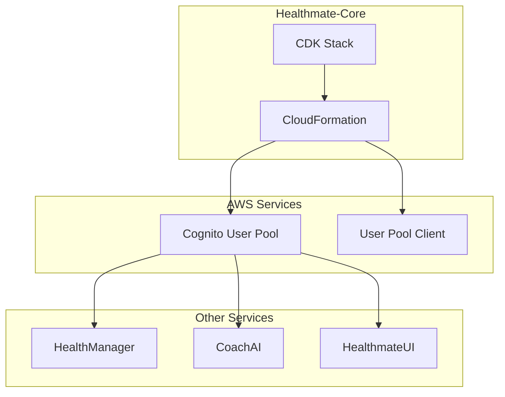

# 設計書

## 概要

Healthmate-Core サービスは、Healthmate プロダクトの認証基盤として Amazon Cognito User Pool を管理します。AWS CDK（Python）を使用してインフラストラクチャをコードとして定義し、他のサービスが利用できる認証リソースを提供します。

## アーキテクチャ

### システム構成



### デプロイメントフロー

1. 開発者が CDK コードを作成
2. `cdk deploy` コマンドを実行
3. CloudFormation が Cognito リソースを作成
4. Output 値が他のサービスで利用可能になる

## コンポーネントとインターフェース

### CDK Stack コンポーネント

**HealthmateCoreStack クラス**
- 責任: Cognito User Pool と User Pool Client の作成・管理
- 入力: なし（設定値はコード内で定義）
- 出力: CloudFormation Output（UserPoolId、UserPoolClientId）

**主要メソッド:**
```python
class HealthmateCoreStack(Stack):
    def __init__(self, scope: Construct, construct_id: str, **kwargs)
    def _create_user_pool(self) -> cognito.UserPool
    def _create_user_pool_client(self, user_pool: cognito.UserPool) -> cognito.UserPoolClient
    def _create_outputs(self, user_pool: cognito.UserPool, client: cognito.UserPoolClient)
```

### Cognito User Pool 設定

**User Pool 設定:**
- Pool Name: "Healthmate-userpool"
- Sign-in aliases: Email
- Password Policy: 強力なパスワード要件
- Account Recovery: Email による回復
- MFA: オプション（将来の拡張用）

**User Pool Client 設定:**
- Client Secret: 無効
- Auth Flows: USER_PASSWORD_AUTH, ALLOW_REFRESH_TOKEN_AUTH
- Token Validity: Access Token 1時間、Refresh Token 30日
- Prevent User Existence Errors: 有効

## データモデル

### CloudFormation Output

```json
{
  "UserPoolId": {
    "Description": "Cognito User Pool ID",
    "Value": "us-west-2_xxxxxxxxx",
    "Export": {
      "Name": "Healthmate-Core-UserPoolId"
    }
  },
  "UserPoolClientId": {
    "Description": "Cognito User Pool Client ID", 
    "Value": "xxxxxxxxxxxxxxxxxxxxxxxxxx",
    "Export": {
      "Name": "Healthmate-Core-UserPoolClientId"
    }
  }
}
```

### User Pool 属性

```python
# 標準属性
standard_attributes = {
    "email": {"required": True, "mutable": True},
    "given_name": {"required": False, "mutable": True},
    "family_name": {"required": False, "mutable": True}
}

# カスタム属性（将来の拡張用）
custom_attributes = {
    "date_of_birth": cognito.StringAttribute(mutable=True),
    "timezone": cognito.StringAttribute(mutable=True)
}
```

## 正確性プロパティ

*プロパティとは、システムのすべての有効な実行において真であるべき特性や動作のことです。これは、人間が読める仕様と機械で検証可能な正確性保証の橋渡しとなります。*
プロパティリフレクション後、以下の正確性プロパティを定義します：

**プロパティ 1: セキュリティ設定の一貫性**
*すべての* User Pool において、パスワードポリシー、属性設定、認証フロー設定が定義された要件に従って適用されている
**検証対象: 要件 3.1, 3.2, 3.3, 3.4**

**プロパティ 2: Output 値の参照可能性**
*すべての* CloudFormation Output において、他のサービスから参照可能な Export 名が設定されており、値が正しい形式で出力されている
**検証対象: 要件 2.3**

**プロパティ 3: CDK 構造の適切性**
*すべての* CDK Stack において、適切なコンストラクト継承とメソッド構造が使用されている
**検証対象: 要件 4.2**

## エラーハンドリング

### CDK デプロイメントエラー

**リソース作成失敗:**
- Cognito サービス制限に達した場合
- IAM 権限不足の場合
- リージョン制約による失敗

**対処方法:**
```python
try:
    user_pool = cognito.UserPool(...)
except Exception as e:
    logger.error(f"User Pool creation failed: {e}")
    raise
```

### 設定検証エラー

**無効な設定値:**
- パスワードポリシーの矛盾
- 属性設定の不整合
- 認証フロー設定の競合

**対処方法:**
```python
def validate_password_policy(policy: dict) -> bool:
    """パスワードポリシーの妥当性を検証"""
    if policy.get("minimum_length", 0) < 8:
        raise ValueError("Password minimum length must be at least 8")
    return True
```

## テスト戦略

### 単体テスト

**CDK 構成テスト:**
- Stack の構成が正しいことを確認
- リソースのプロパティが期待値と一致することを確認
- Output の定義が正しいことを確認

**設定検証テスト:**
- パスワードポリシーの各項目をテスト
- 属性設定の妥当性をテスト
- 認証フロー設定の正確性をテスト

### プロパティベーステスト

**テストライブラリ:** pytest + hypothesis
**最小実行回数:** 100回の反復実行

**プロパティテストの実装:**
- セキュリティ設定の一貫性を検証するプロパティテスト
- Output 値の参照可能性を検証するプロパティテスト
- CDK 構造の適切性を検証するプロパティテスト

### 統合テスト

**実際のデプロイメントテスト:**
- CDK デプロイが成功することを確認
- 作成されたリソースが期待通りの設定を持つことを確認
- Output 値が他のサービスから参照可能であることを確認

**クリーンアップテスト:**
- リソースの削除が正常に行われることを確認
- 依存関係のあるリソースが適切に処理されることを確認