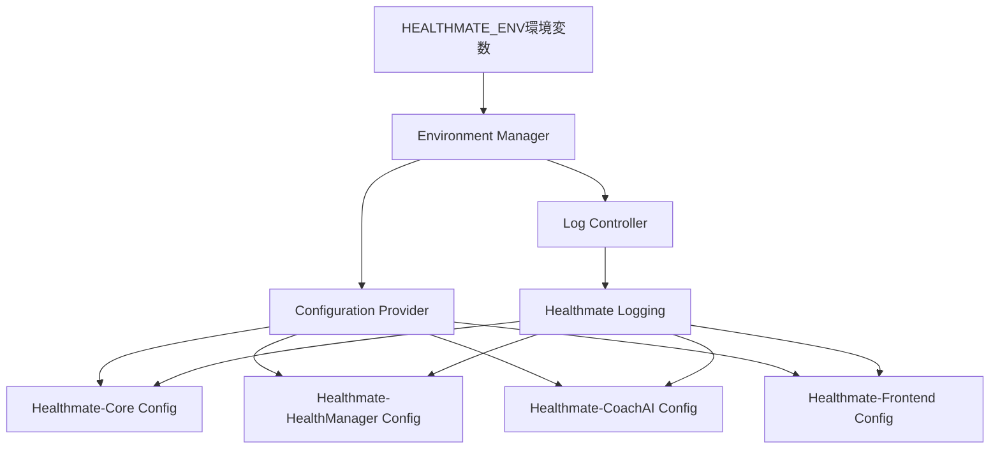
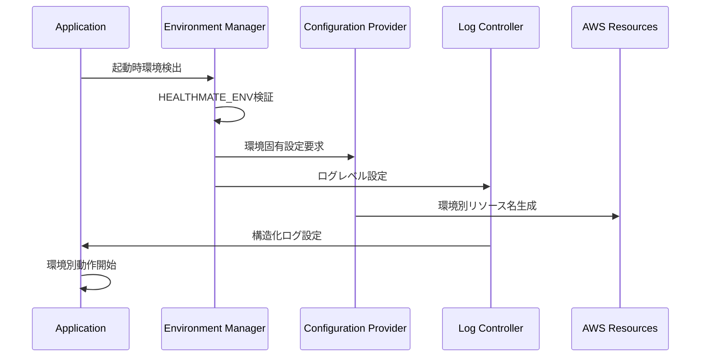

# 設計文書

## 概要

Healthmate プロダクト全体の環境設定とログ管理システムの設計です。HEALTHMATE_ENV環境変数（dev/stage/prod）による環境制御と、環境に応じたログレベル制御を実装します。各サービスで一貫した環境設定を提供し、段階的な実装とテストをサポートします。

## アーキテクチャ

### 全体アーキテクチャ



### 環境設定フロー



## コンポーネントと インターフェース

### Environment Manager

環境変数の検証と環境設定の統合管理を行います。

```python
class EnvironmentManager:
    """環境設定の統合管理"""
    
    VALID_ENVIRONMENTS = ["dev", "stage", "prod"]
    DEFAULT_ENVIRONMENT = "dev"
    
    @classmethod
    def get_environment(cls) -> str:
        """現在の環境を取得"""
        env = os.environ.get("HEALTHMATE_ENV", cls.DEFAULT_ENVIRONMENT)
        if env not in cls.VALID_ENVIRONMENTS:
            logger.error(f"Invalid environment: {env}, defaulting to {cls.DEFAULT_ENVIRONMENT}")
            return cls.DEFAULT_ENVIRONMENT
        logger.info(f"Environment detected: {env}")
        return env
    
    @classmethod
    def validate_environment(cls, env: str) -> bool:
        """環境値の検証"""
        return env in cls.VALID_ENVIRONMENTS
    
    @classmethod
    def is_production(cls) -> bool:
        """本番環境かどうか"""
        return cls.get_environment() == "prod"
    
    @classmethod
    def is_development(cls) -> bool:
        """開発環境かどうか"""
        return cls.get_environment() == "dev"
```

### Configuration Provider

各サービスに環境固有の設定を提供します。

```python
class ConfigurationProvider:
    """環境固有設定の提供"""
    
    def __init__(self, service_name: str):
        self.service_name = service_name
        self.environment = EnvironmentManager.get_environment()
    
    def get_resource_name(self, base_name: str) -> str:
        """環境別リソース名の生成"""
        if self.environment == "prod":
            return base_name
        return f"{base_name}-{self.environment}"
    
    def get_dynamodb_table_name(self, table_name: str) -> str:
        """DynamoDBテーブル名の生成"""
        return self.get_resource_name(f"healthmate-{table_name}")
    
    def get_lambda_function_name(self, function_name: str) -> str:
        """Lambda関数名の生成"""
        return self.get_resource_name(f"healthmate-{function_name}")
    
    def get_cognito_user_pool_name(self) -> str:
        """Cognito User Pool名の生成"""
        return self.get_resource_name("Healthmate-userpool")
    
    def get_agentcore_role_name(self) -> str:
        """AgentCore IAMロール名の生成"""
        return self.get_resource_name("Healthmate-CoachAI-AgentCore-Runtime-Role")
    
    def get_cloudformation_export_name(self, export_name: str) -> str:
        """CloudFormation Export名の生成"""
        return self.get_resource_name(f"Healthmate-{export_name}")
```

### Log Controller

環境に応じたログレベル制御と構造化ログを提供します。

```python
import logging
import json
from datetime import datetime
from typing import Dict, Any

class LogController:
    """環境別ログ制御"""
    
    LOG_LEVELS = {
        "dev": logging.DEBUG,
        "stage": logging.INFO,
        "prod": logging.WARNING
    }
    
    def __init__(self, service_name: str):
        self.service_name = service_name
        self.environment = EnvironmentManager.get_environment()
        self.setup_logging()
    
    def setup_logging(self):
        """ログ設定の初期化"""
        log_level = self.LOG_LEVELS.get(self.environment, logging.INFO)
        
        # ルートロガーの設定
        root_logger = logging.getLogger()
        root_logger.setLevel(log_level)
        
        # 既存のハンドラーをクリア
        for handler in root_logger.handlers[:]:
            root_logger.removeHandler(handler)
        
        # 新しいハンドラーを追加
        handler = logging.StreamHandler()
        handler.setLevel(log_level)
        
        if self.environment == "dev":
            # 開発環境：人間が読みやすい形式
            formatter = logging.Formatter(
                '%(asctime)s - %(name)s - %(levelname)s - [%(service)s:%(environment)s] - %(message)s'
            )
        else:
            # stage/prod環境：JSON形式
            formatter = JSONFormatter(self.service_name, self.environment)
        
        handler.setFormatter(formatter)
        root_logger.addHandler(handler)
        
        # ログレベル変更をログに記録
        logging.info(f"Log level set to {logging.getLevelName(log_level)} for environment {self.environment}")
    
    def get_logger(self, name: str) -> logging.Logger:
        """サービス固有ロガーの取得"""
        logger = logging.getLogger(name)
        # サービス名と環境をコンテキストに追加
        logger = logging.LoggerAdapter(logger, {
            'service': self.service_name,
            'environment': self.environment
        })
        return logger

class JSONFormatter(logging.Formatter):
    """JSON形式のログフォーマッター"""
    
    def __init__(self, service_name: str, environment: str):
        super().__init__()
        self.service_name = service_name
        self.environment = environment
    
    def format(self, record: logging.LogRecord) -> str:
        log_entry = {
            'timestamp': datetime.utcnow().isoformat() + 'Z',
            'level': record.levelname,
            'service': self.service_name,
            'environment': self.environment,
            'message': record.getMessage(),
            'logger': record.name
        }
        
        # 例外情報がある場合は追加
        if record.exc_info:
            log_entry['exception'] = self.formatException(record.exc_info)
        
        # 追加のコンテキスト情報
        if hasattr(record, 'user_id'):
            log_entry['user_id'] = record.user_id
        if hasattr(record, 'request_id'):
            log_entry['request_id'] = record.request_id
        
        return json.dumps(log_entry, ensure_ascii=False)
```

## データモデル

### 環境設定データ構造

```python
from dataclasses import dataclass
from typing import Dict, Optional

@dataclass
class EnvironmentConfig:
    """環境設定データクラス"""
    environment: str
    service_name: str
    aws_region: str
    log_level: str
    resource_suffix: str
    
    # AWS リソース設定
    dynamodb_tables: Dict[str, str]
    lambda_functions: Dict[str, str]
    cognito_config: Dict[str, str]
    agentcore_config: Dict[str, str]
    
    # エンドポイント設定
    api_endpoints: Dict[str, str]
    
    @classmethod
    def create_for_service(cls, service_name: str) -> 'EnvironmentConfig':
        """サービス固有の環境設定を作成"""
        env = EnvironmentManager.get_environment()
        config_provider = ConfigurationProvider(service_name)
        
        return cls(
            environment=env,
            service_name=service_name,
            aws_region=os.environ.get("AWS_REGION", "us-west-2"),
            log_level=LogController.LOG_LEVELS[env],
            resource_suffix="" if env == "prod" else f"-{env}",
            dynamodb_tables=cls._get_dynamodb_config(config_provider),
            lambda_functions=cls._get_lambda_config(config_provider),
            cognito_config=cls._get_cognito_config(config_provider),
            agentcore_config=cls._get_agentcore_config(config_provider),
            api_endpoints=cls._get_api_endpoints(config_provider)
        )
    
    @staticmethod
    def _get_dynamodb_config(provider: ConfigurationProvider) -> Dict[str, str]:
        """DynamoDB設定の生成"""
        return {
            "users": provider.get_dynamodb_table_name("users"),
            "goals": provider.get_dynamodb_table_name("goals"),
            "policies": provider.get_dynamodb_table_name("policies"),
            "activities": provider.get_dynamodb_table_name("activities")
        }
    
    @staticmethod
    def _get_lambda_config(provider: ConfigurationProvider) -> Dict[str, str]:
        """Lambda設定の生成"""
        return {
            "user_lambda": provider.get_lambda_function_name("UserLambda"),
            "goal_lambda": provider.get_lambda_function_name("GoalLambda"),
            "policy_lambda": provider.get_lambda_function_name("PolicyLambda"),
            "activity_lambda": provider.get_lambda_function_name("ActivityLambda")
        }
    
    @staticmethod
    def _get_cognito_config(provider: ConfigurationProvider) -> Dict[str, str]:
        """Cognito設定の生成"""
        return {
            "user_pool_name": provider.get_cognito_user_pool_name(),
            "user_pool_id_export": provider.get_cloudformation_export_name("UserPoolId"),
            "client_id_export": provider.get_cloudformation_export_name("UserPoolClientId")
        }
    
    @staticmethod
    def _get_agentcore_config(provider: ConfigurationProvider) -> Dict[str, str]:
        """AgentCore設定の生成"""
        return {
            "role_name": provider.get_agentcore_role_name(),
            "memory_id": f"healthmate_coach_ai_mem-{provider.environment}"
        }
    
    @staticmethod
    def _get_api_endpoints(provider: ConfigurationProvider) -> Dict[str, str]:
        """API エンドポイント設定の生成"""
        # 環境別エンドポイントの設定
        base_domain = "healthmate.example.com"  # 実際のドメインに置き換え
        
        if provider.environment == "prod":
            return {
                "mcp_gateway": f"https://api.{base_domain}",
                "agentcore": f"https://agent.{base_domain}"
            }
        else:
            return {
                "mcp_gateway": f"https://api-{provider.environment}.{base_domain}",
                "agentcore": f"https://agent-{provider.environment}.{base_domain}"
            }
```

### 環境変数ファイル構造

各サービスで使用する環境変数ファイルの構造：

```bash
# .env.dev
HEALTHMATE_ENV=dev
AWS_REGION=us-west-2
LOG_LEVEL=DEBUG

# サービス固有設定
COGNITO_USER_POOL_ID=us-west-2_xxxxxxxxx
COGNITO_CLIENT_ID=xxxxxxxxxxxxxxxxxxxxxxxxxx
MCP_GATEWAY_ENDPOINT=https://api-dev.healthmate.example.com
AGENTCORE_ENDPOINT=https://agent-dev.healthmate.example.com

# .env.stage  
HEALTHMATE_ENV=stage
AWS_REGION=us-west-2
LOG_LEVEL=INFO

# .env.prod
HEALTHMATE_ENV=prod
AWS_REGION=us-west-2
LOG_LEVEL=WARNING
```
## 正確性プロパティ

*プロパティとは、システムのすべての有効な実行において真であるべき特性や動作のことです。プロパティは、人間が読める仕様と機械で検証可能な正確性保証の橋渡しとなります。*

### プロパティ 1: 環境検証の一貫性

*すべての* 有効な環境値について、Environment_Managerが環境を検証する際、同じ入力に対して常に同じ結果を返すべきです。

**検証: 要件 1.1, 1.3, 1.4**

### プロパティ 2: リソース名の環境別一意性

*すべての* リソース名とベース名の組み合わせについて、Configuration_Providerが生成するリソース名は、同じ環境内で一意であり、異なる環境間では区別可能であるべきです。

**検証: 要件 3.4, 3.5, 3.6**

### プロパティ 3: ログレベル階層の保持

*すべての* 環境とログメッセージについて、Log_Controllerは環境に応じたログレベル階層（DEBUG < INFO < WARNING）を維持し、設定されたレベル以上のメッセージのみを出力するべきです。

**検証: 要件 2.4, 2.5**

### プロパティ 4: 環境設定の冪等性

*すべての* サービスと環境について、同じ環境変数で複数回初期化を行っても、同じ設定結果が得られるべきです。

**検証: 要件 4.1, 4.2**

### プロパティ 5: 構造化ログの完全性

*すべての* ログエントリについて、Log_Controllerが出力する構造化ログには、必須フィールド（timestamp、level、service、environment、message）がすべて含まれているべきです。

**検証: 要件 5.1, 5.2, 5.5, 5.6**

### プロパティ 6: デプロイ検証の確実性

*すべての* デプロイ操作について、Environment_Managerは無効な環境設定を検出し、適切なエラーハンドリングを行うべきです。

**検証: 要件 6.1, 6.2, 6.3, 6.4, 6.5**

### プロパティ 7: 後方互換性の保持

*すべての* レガシー設定について、Environment_Managerは新しい環境設定が適用されても、既存のデータと動作を保持するべきです。

**検証: 要件 7.2, 7.4, 7.5**

## エラーハンドリング

### 環境変数エラー

```python
class EnvironmentError(Exception):
    """環境設定関連のエラー"""
    pass

class InvalidEnvironmentError(EnvironmentError):
    """無効な環境値エラー"""
    def __init__(self, environment: str):
        self.environment = environment
        super().__init__(f"Invalid environment: {environment}")

class ConfigurationError(EnvironmentError):
    """設定エラー"""
    pass

def handle_environment_error(func):
    """環境エラーハンドリングデコレータ"""
    def wrapper(*args, **kwargs):
        try:
            return func(*args, **kwargs)
        except InvalidEnvironmentError as e:
            logger.error(f"Environment error: {e}")
            # デフォルト環境にフォールバック
            return EnvironmentManager.DEFAULT_ENVIRONMENT
        except ConfigurationError as e:
            logger.error(f"Configuration error: {e}")
            raise
        except Exception as e:
            logger.error(f"Unexpected error in environment management: {e}")
            raise EnvironmentError(f"Environment management failed: {e}")
    return wrapper
```

### ログエラー処理

```python
class LoggingError(Exception):
    """ログ関連のエラー"""
    pass

def safe_logging_setup(service_name: str) -> LogController:
    """安全なログ設定"""
    try:
        return LogController(service_name)
    except Exception as e:
        # フォールバック：基本的なログ設定
        logging.basicConfig(
            level=logging.INFO,
            format='%(asctime)s - %(name)s - %(levelname)s - %(message)s'
        )
        logger = logging.getLogger(__name__)
        logger.error(f"Failed to setup advanced logging: {e}")
        logger.info("Using fallback logging configuration")
        return None
```

### AWS リソースエラー

```python
def handle_aws_resource_error(operation: str):
    """AWS リソース操作エラーハンドリング"""
    def decorator(func):
        def wrapper(*args, **kwargs):
            try:
                return func(*args, **kwargs)
            except ClientError as e:
                error_code = e.response['Error']['Code']
                if error_code == 'ResourceNotFoundException':
                    logger.warning(f"AWS resource not found during {operation}: {e}")
                    return None
                elif error_code == 'AccessDenied':
                    logger.error(f"Access denied during {operation}: {e}")
                    raise ConfigurationError(f"Insufficient permissions for {operation}")
                else:
                    logger.error(f"AWS error during {operation}: {e}")
                    raise ConfigurationError(f"AWS operation failed: {operation}")
            except Exception as e:
                logger.error(f"Unexpected error during {operation}: {e}")
                raise ConfigurationError(f"Operation failed: {operation}")
        return wrapper
    return decorator
```

## テスト戦略

### 二重テストアプローチ

この環境設定システムでは、単体テストとプロパティベーステストの両方を使用して包括的なカバレッジを実現します：

- **単体テスト**: 特定の例、エッジケース、エラー条件を検証
- **プロパティテスト**: すべての入力にわたる普遍的なプロパティを検証
- **統合テスト**: サービス間の環境設定連携を検証

### プロパティベーステスト設定

- **テストライブラリ**: pytest + hypothesis
- **最小実行回数**: 各プロパティテストで100回の反復
- **テストタグ**: **Feature: environment-configuration, Property {number}: {property_text}**

### テスト範囲

#### 単体テスト
- 環境変数の検証ロジック
- リソース名生成の正確性
- ログレベル設定の動作
- エラーハンドリングの動作
- 設定ファイルの読み込み

#### プロパティテスト
- 環境検証の一貫性（プロパティ1）
- リソース名の一意性（プロパティ2）
- ログレベル階層（プロパティ3）
- 設定の冪等性（プロパティ4）
- 構造化ログの完全性（プロパティ5）
- 後方互換性（プロパティ6）

#### 統合テスト
- サービス間での環境設定の一貫性
- AWS リソースとの実際の連携
- 段階的デプロイメントフロー
- 環境切り替え時の動作

### テスト実行環境

```python
# テスト用環境設定
@pytest.fixture
def test_environment():
    """テスト用環境設定"""
    original_env = os.environ.get("HEALTHMATE_ENV")
    os.environ["HEALTHMATE_ENV"] = "dev"
    yield
    if original_env:
        os.environ["HEALTHMATE_ENV"] = original_env
    else:
        os.environ.pop("HEALTHMATE_ENV", None)

@pytest.fixture
def mock_aws_resources():
    """AWS リソースのモック"""
    with mock_dynamodb(), mock_cognitoidp():
        yield

# プロパティテスト用ジェネレータ
@given(
    environment=st.sampled_from(["dev", "stage", "prod"]),
    service_name=st.text(min_size=1, max_size=50, alphabet=st.characters(whitelist_categories=('Lu', 'Ll', 'Nd', 'Pc'))),
    resource_name=st.text(min_size=1, max_size=100, alphabet=st.characters(whitelist_categories=('Lu', 'Ll', 'Nd', 'Pc')))
)
def test_resource_name_uniqueness_property(environment, service_name, resource_name):
    """プロパティ2: リソース名の環境別一意性"""
    # Feature: environment-configuration, Property 2: リソース名の環境別一意性
    pass
```

## 実装計画

### 段階的実装順序

#### フェーズ 1: Healthmate-Core
1. 共通環境設定モジュールの実装
2. Environment Manager の作成
3. Log Controller の基本実装
4. Cognito環境別設定の適用
5. 単体テストとプロパティテストの実装
6. 環境別デプロイテスト

#### フェーズ 2: Healthmate-HealthManager
1. Configuration Provider の拡張
2. DynamoDB環境別テーブル設定
3. Lambda環境別関数名設定
4. MCP Gateway環境別設定
5. 統合テスト（Core連携）
6. 環境別動作確認

#### フェーズ 3: Healthmate-CoachAI
1. AgentCore環境別設定
2. IAMロール環境別命名
3. MCP クライアント環境設定
4. メモリID環境別設定
5. 統合テスト（HealthManager連携）
6. エージェント動作確認

#### フェーズ 4: Healthmate-Frontend
1. 環境別ビルド設定
2. API エンドポイント環境設定
3. Cognito環境別設定
4. 環境変数ファイル管理
5. 全サービス統合テスト
6. E2E環境別動作確認

### 移行戦略

#### 後方互換性の維持
```python
class LegacyConfigSupport:
    """レガシー設定のサポート"""
    
    @staticmethod
    def detect_legacy_config() -> bool:
        """レガシー設定の検出"""
        # 既存の設定ファイルや環境変数をチェック
        return not os.environ.get("HEALTHMATE_ENV")
    
    @staticmethod
    def migrate_legacy_config():
        """レガシー設定の移行"""
        if LegacyConfigSupport.detect_legacy_config():
            logger.warning("Legacy configuration detected. Consider migrating to HEALTHMATE_ENV.")
            # 既存の設定を新しい形式にマッピング
            os.environ.setdefault("HEALTHMATE_ENV", "dev")
```

#### 段階的移行手順
1. **準備フェーズ**: 新しい環境設定コードの実装（既存動作に影響なし）
2. **テストフェーズ**: dev環境での新設定テスト
3. **移行フェーズ**: stage環境での新設定適用
4. **本番適用**: prod環境での新設定適用
5. **クリーンアップ**: レガシー設定コードの削除

この設計により、Healthmate プロダクト全体で一貫した環境管理とログ制御が実現され、安全で確実な本番運用が可能になります。